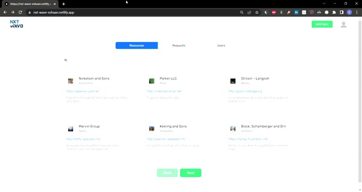
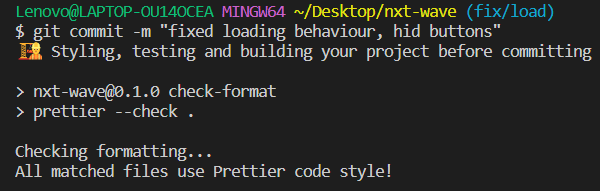
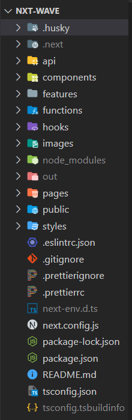
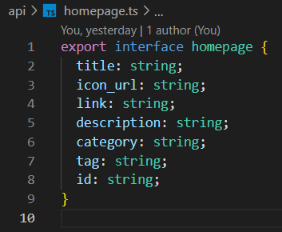
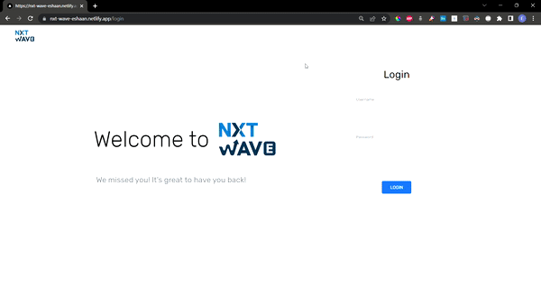
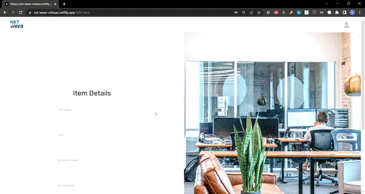
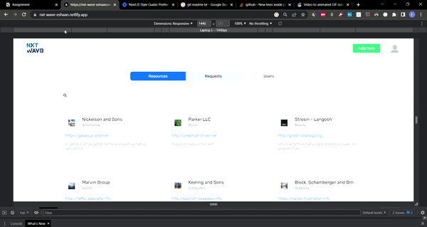

This is my submission for NXT WAVE's SDE-1 Frontend role. [link](https://nxt-wave-eshaan.netlify.app/)

# NXT-WAVE Submission

This project was built with NextJS, TypeScript, and Sass. Enterprise-friendly practices were utilized to build this, keeping in mind, the robustness, type checks, and fool-proof design.


<br/>
###### *Fig 1. Showing how the tabs filter and display relevant data.*
<br/>

## Initialisation

The following technologies were used

- NextJS
- TypeScript
- Sass
- Prettier configuration
- Husky
- axios

To initialize the app, first NextJS app was initialized with TypeScript configuration as follows:

```bash
npx create-next-app@latest --ts
# or
yarn create next-app --typescript
```

Prettier is an opinionated code formatter that ensures one unified code format. Hence configuring the project in accordance with it, helps maintain code flows and maintain uniformity.

```bash
npm install prettier
```

Following this, a prettier config file was also declared for opinionated prettifying. Running the below instruction, prettifies all the code, except the one in the prettier ignore file.

```bash
npm run format
```

Husky is a tool that allows us to check the commits before we make errors while committing itself. Hence it is a powerful tool that runs ts and prettier checks all over the code base. It was only relevant and necessary to install it.

To initialize the app, first NextJS app was initialized with TypeScript configuration as follows:

```bash
npm install husky
```

## Development

The development process was simple. Start from the top, and create components one by one, fully styled. Responsiveness was taken care of once compound components were ready to be built.

### Husky Commits

Husky checks all the code, for type errors and prettier configurations, and on passing the test only, will it ever commit anything to the GitHub repo. This protects the repo from broken and erred commits.


<br/>
###### *Fig 2. Husky checks the prettier configuration and typescript checks.*
<br/>

### Directory Structure


<br/>
###### *Fig 3. Directory structure for the web app.*
<br/>

Within the NextJS App, several folders were created.

- **Components** include reusable single components, that can be called throughout the project.
- **Features** include multiple components and JSX elements to create compound sections and features.
- **Hooks** consist of user-defined hooks built by the user.
- **Functions** include API functions and other functions as well.
- **Types** include the type interface of the data retrieved using the API.

### Styling with Sass

- A single Variable file was used to declare variables for colors and fonts along with key-frame animations.
- Sass provides a way to import these within other Sass files.
- This allows easy tracking and maintenance of the code base.

### Typescript FTW

- Typescript allows us to check the legitimacy of the code that we write.
- Every single component has a type/interface attached, so if the developer skips over the essential props, or assigns unexpected values, it will throw errors.
- This helps us to write foolproof and robust code.


<br/>
###### *Fig 4. This is the type Generated for the data fetched by the API*
<br/>

## Features

### Search with Debounce

**Debounce** helps limit the API requests, by clubbing search queries while polling input at a particular interval. The search string changes every 800 ms, thus limiting the search queries. if used without debounce, every single character input and backspace will trigger a query.
- First the data is filtered in accordance to tabs (resource/user/request).
- Then the data is filered in accordance to the inclusion of the search query string.
- Lastly the data is queried in accordance to the page number ([0, 5], [6, 11] ...).
- Finally, this data is mapped onto a card component.


<br/>
###### *Fig 5. Search queries are debounced so as to reduce processing load and rerenders*
<br />

### Login Check
The login form saves an authentication token in the local storage of the application. Hence, even on reload, one can stay logged into the app.
- The form checks incomplete inputs.
- Since there is no backend, any input will provide a valid authentication.
- All pages redirect to login if the user hasn't logged in.


<br/>
###### *Fig 6. The login page*
<br />

### Pagination
- A useState variable saves the page range into an array of two numbers.
- Filters kick in and display only the items within the page range ([0, 5], [6, 11] ...).
- Page range updates on button clicks.
- Buttons are disabled if page range cannot be incremented or decremented.


<br/>
###### *Fig 7. At max 6 results are shown in the paginated items-display*
<br />

### Input Check

- Empty input fields are checked before making a post request.
- useRef was used as a prefer value handling paradigm.


<br/>
###### *Fig 8. The add Items page has empty checks for every form field*
<br />

### Responsiveness

- Several media query breakpoints were declared in the variable file.
- Apart from that, grid-template and flex was used to handle the responsive behaviour of the app.


<br/>
###### *Fig 9. Fully responsive design*
<br />

### Smooth Animations

- A bunch of keyframe animations were declared in the variable.scss file.
- The were called throught the application.


<br/>
###### *Fig 10. Smooth Animations*
<br />

## References

To learn more about Next.js, take a look at the following resources:

- [Next.js Documentation](https://nextjs.org/docs) - learn about Next.js features and API.
- [Learn Next.js](https://nextjs.org/learn) - an interactive Next.js tutorial.

You can check out [the Next.js GitHub repository](https://github.com/vercel/next.js/) - your feedback and contributions are welcome!
